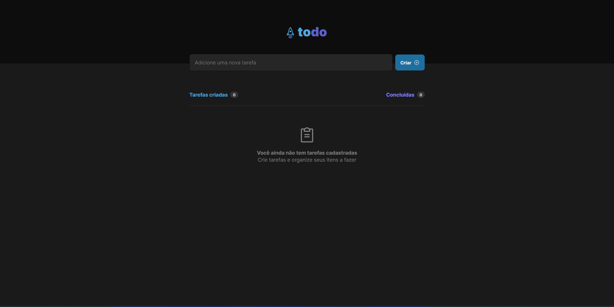
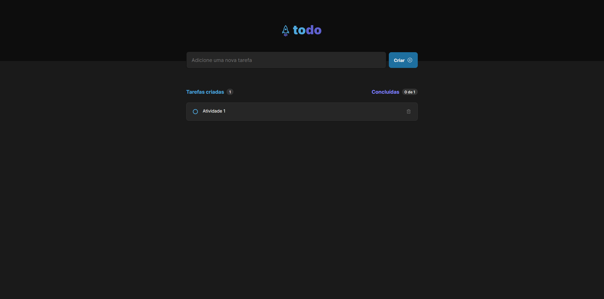
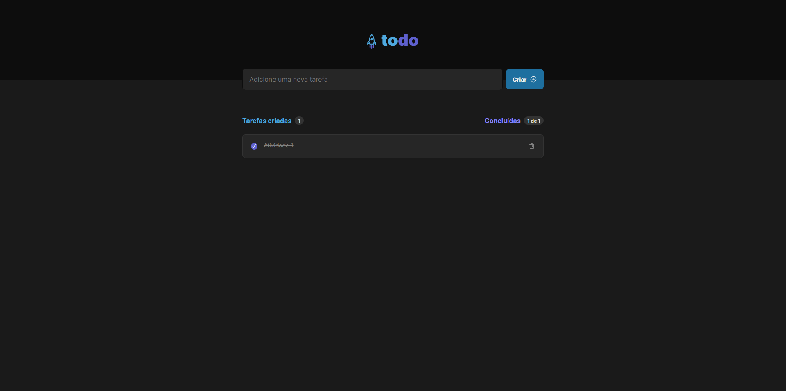

# ToDo List

Aplicação desenvolvida durante a trilha de ReactJS, dentro do curso Ignite da Rocketseat. O intuito desse projeto é colocar em prática os conceitos fundamentais do React.

A aplicação consiste em cadastrar e manter o controle de tarefas.

# Capturas de tela
<p align="center">
  
</p>

<p align="center">
  
</p>

<p align="center">
  
</p>

# Como rodar

## Instalar as dependências
```bash
$ npm install
```

## Executar a aplicação
```bash
$ npm run dev
```
